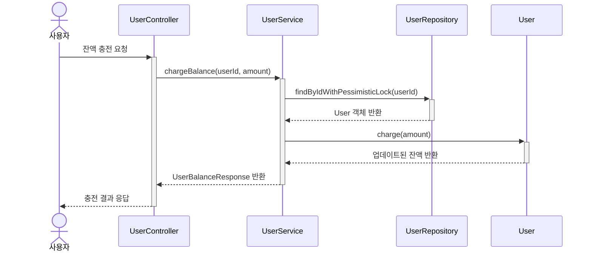
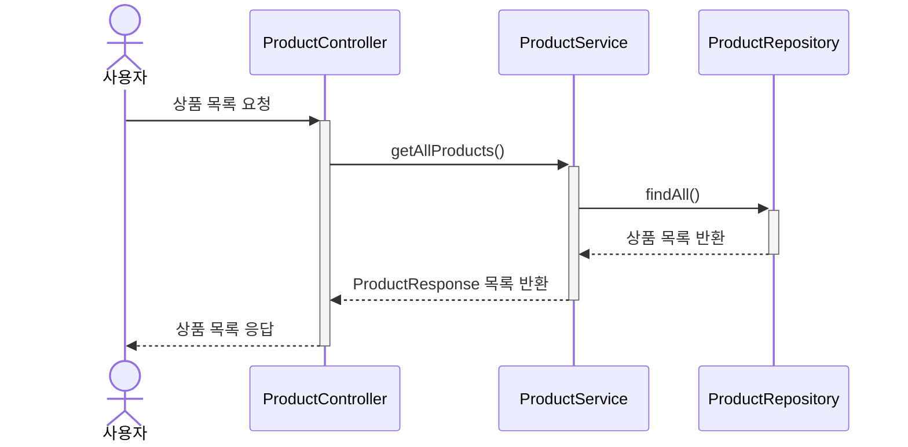
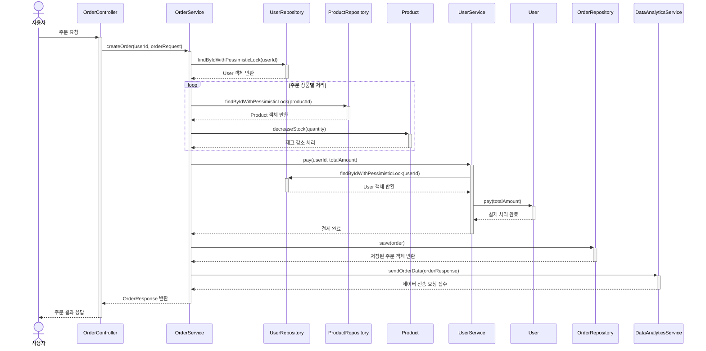
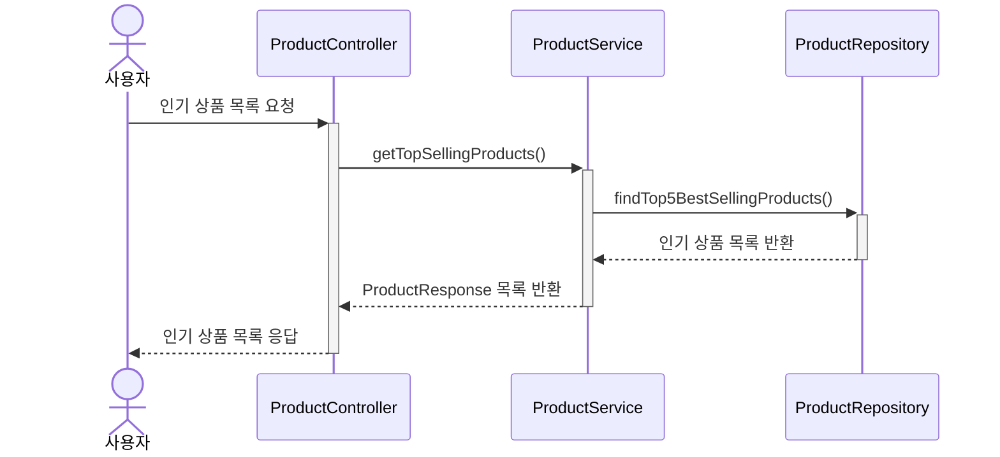
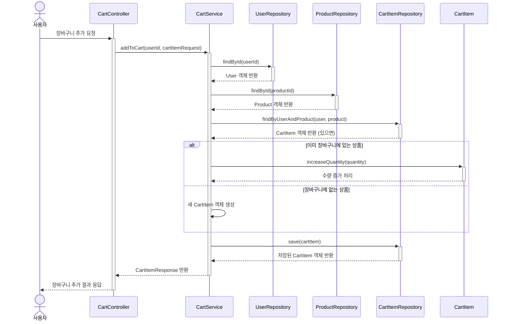
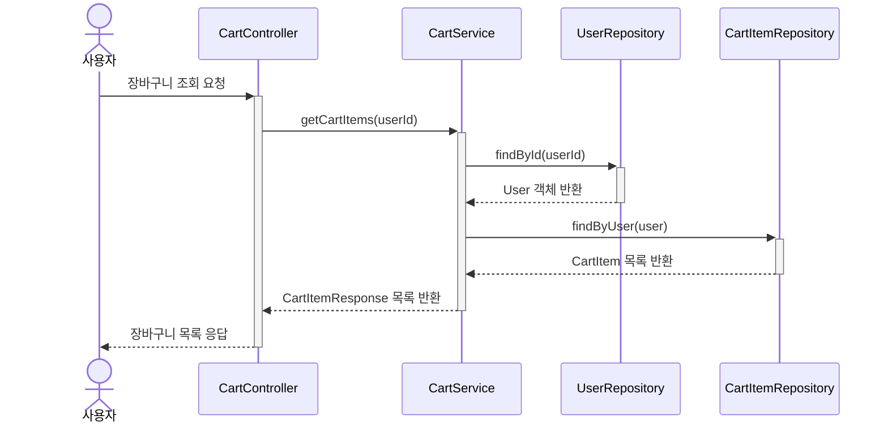

# 시퀀스 다이어그램

## 1. 잔액 충전 시퀀스

```mermaid
sequenceDiagram
    Actor 사용자
    사용자->>+UserController: 잔액 충전 요청
    UserController->>+UserService: chargeBalance(userId, amount)
    UserService->>+UserRepository: findByIdWithPessimisticLock(userId)
    UserRepository-->>-UserService: User 객체 반환
    UserService->>+User: charge(amount)
    User-->>-UserService: 업데이트된 잔액 반환
    UserService-->>-UserController: UserBalanceResponse 반환
    UserController-->>-사용자: 충전 결과 응답
```

## 2. 상품 조회 시퀀스

```mermaid
sequenceDiagram
    Actor 사용자
    사용자->>+ProductController: 상품 목록 요청
    ProductController->>+ProductService: getAllProducts()
    ProductService->>+ProductRepository: findAll()
    ProductRepository-->>-ProductService: 상품 목록 반환
    ProductService-->>-ProductController: ProductResponse 목록 반환
    ProductController-->>-사용자: 상품 목록 응답
```

## 3. 주문 및 결제 시퀀스

```mermaid
sequenceDiagram
    Actor 사용자
    사용자->>+OrderController: 주문 요청
    OrderController->>+OrderService: createOrder(userId, orderRequest)
    OrderService->>+UserRepository: findByIdWithPessimisticLock(userId)
    UserRepository-->>-OrderService: User 객체 반환
    
    loop 주문 상품별 처리
        OrderService->>+ProductRepository: findByIdWithPessimisticLock(productId)
        ProductRepository-->>-OrderService: Product 객체 반환
        OrderService->>+Product: decreaseStock(quantity)
        Product-->>-OrderService: 재고 감소 처리
    end
    
    OrderService->>+UserService: pay(userId, totalAmount)
    UserService->>+UserRepository: findByIdWithPessimisticLock(userId)
    UserRepository-->>-UserService: User 객체 반환
    UserService->>+User: pay(totalAmount)
    User-->>-UserService: 결제 처리 완료
    UserService-->>-OrderService: 결제 완료
    
    OrderService->>+OrderRepository: save(order)
    OrderRepository-->>-OrderService: 저장된 주문 객체 반환
    
    OrderService->>+DataAnalyticsService: sendOrderData(orderResponse)
    DataAnalyticsService-->>-OrderService: 데이터 전송 요청 접수
    
    OrderService-->>-OrderController: OrderResponse 반환
    OrderController-->>-사용자: 주문 결과 응답
```

## 4. 인기 상품 조회 시퀀스

```mermaid
sequenceDiagram
    Actor 사용자
    사용자->>+ProductController: 인기 상품 목록 요청
    ProductController->>+ProductService: getTopSellingProducts()
    ProductService->>+ProductRepository: findTop5BestSellingProducts()
    ProductRepository-->>-ProductService: 인기 상품 목록 반환
    ProductService-->>-ProductController: ProductResponse 목록 반환
    ProductController-->>-사용자: 인기 상품 목록 응답
```

## 5. 장바구니 관리 시퀀스

### 5.1 장바구니에 상품 추가

```mermaid
sequenceDiagram
    Actor 사용자
    사용자->>+CartController: 장바구니 추가 요청
    CartController->>+CartService: addToCart(userId, cartItemRequest)
    CartService->>+UserRepository: findById(userId)
    UserRepository-->>-CartService: User 객체 반환
    CartService->>+ProductRepository: findById(productId)
    ProductRepository-->>-CartService: Product 객체 반환
    CartService->>+CartItemRepository: findByUserAndProduct(user, product)
    CartItemRepository-->>-CartService: CartItem 객체 반환 (있으면)
    
    alt 이미 장바구니에 있는 상품
        CartService->>+CartItem: increaseQuantity(quantity)
        CartItem-->>-CartService: 수량 증가 처리
    else 장바구니에 없는 상품
        CartService->>CartService: 새 CartItem 객체 생성
    end
    
    CartService->>+CartItemRepository: save(cartItem)
    CartItemRepository-->>-CartService: 저장된 CartItem 객체 반환
    CartService-->>-CartController: CartItemResponse 반환
    CartController-->>-사용자: 장바구니 추가 결과 응답
```

### 5.2 장바구니 조회

```mermaid
sequenceDiagram
    Actor 사용자
    사용자->>+CartController: 장바구니 조회 요청
    CartController->>+CartService: getCartItems(userId)
    CartService->>+UserRepository: findById(userId)
    UserRepository-->>-CartService: User 객체 반환
    CartService->>+CartItemRepository: findByUser(user)
    CartItemRepository-->>-CartService: CartItem 목록 반환
    CartService-->>-CartController: CartItemResponse 목록 반환
    CartController-->>-사용자: 장바구니 목록 응답
```
