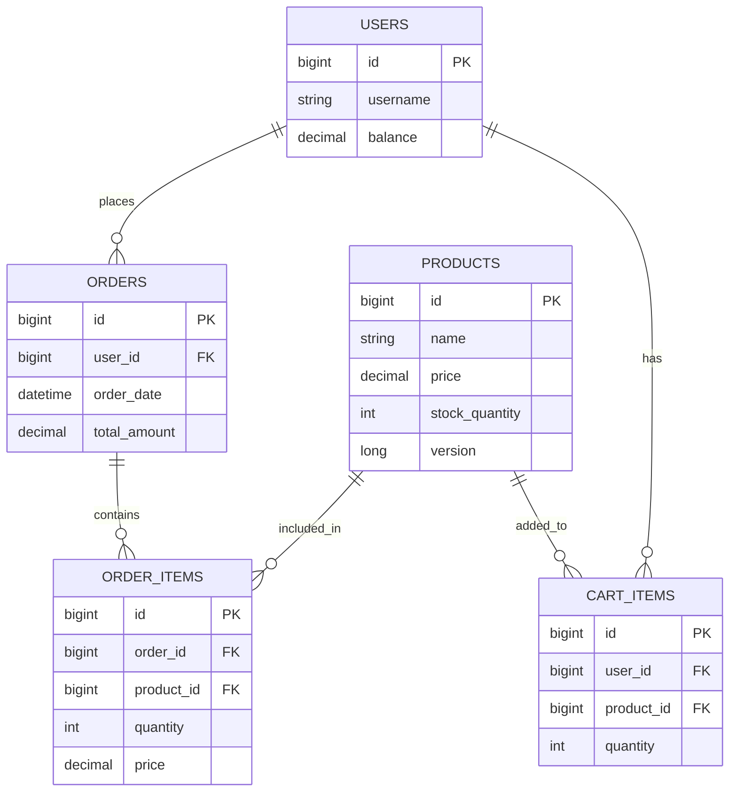

# ERD 정의서

## 전체 ERD 다이어그램

## 테이블 상세 정의

### 1. USERS 테이블

사용자 정보를 저장하는 테이블입니다.

| 컬럼명 | 데이터 타입 | 제약조건 | 설명 |
|-------|------------|---------|------|
| id | BIGINT | PRIMARY KEY, AUTO_INCREMENT | 사용자 고유 식별자 |
| username | VARCHAR(255) | NOT NULL, UNIQUE | 사용자 이름 |
| balance | DECIMAL(19,2) | NOT NULL, DEFAULT 0 | 사용자 잔액 |

### 2. PRODUCTS 테이블

상품 정보를 저장하는 테이블입니다.

| 컬럼명 | 데이터 타입 | 제약조건 | 설명 |
|-------|------------|---------|------|
| id | BIGINT | PRIMARY KEY, AUTO_INCREMENT | 상품 고유 식별자 |
| name | VARCHAR(255) | NOT NULL | 상품 이름 |
| price | DECIMAL(19,2) | NOT NULL | 상품 가격 |
| stock_quantity | INT | NOT NULL | 재고 수량 |
| version | BIGINT | NOT NULL, DEFAULT 0 | 낙관적 락을 위한 버전 정보 |

### 3. ORDERS 테이블

주문 정보를 저장하는 테이블입니다.

| 컬럼명 | 데이터 타입 | 제약조건 | 설명 |
|-------|------------|---------|------|
| id | BIGINT | PRIMARY KEY, AUTO_INCREMENT | 주문 고유 식별자 |
| user_id | BIGINT | FOREIGN KEY | 주문한 사용자 ID |
| order_date | DATETIME | NOT NULL | 주문 일시 |
| total_amount | DECIMAL(19,2) | NOT NULL | 주문 총액 |

### 4. ORDER_ITEMS 테이블

주문에 포함된 상품 항목을 저장하는 테이블입니다.

| 컬럼명 | 데이터 타입 | 제약조건 | 설명 |
|-------|------------|---------|------|
| id | BIGINT | PRIMARY KEY, AUTO_INCREMENT | 주문 항목 고유 식별자 |
| order_id | BIGINT | FOREIGN KEY | 주문 ID |
| product_id | BIGINT | FOREIGN KEY | 상품 ID |
| quantity | INT | NOT NULL | 주문 수량 |
| price | DECIMAL(19,2) | NOT NULL | 주문 당시의 상품 가격 |

### 5. CART_ITEMS 테이블

장바구니에 담긴 상품 항목을 저장하는 테이블입니다.

| 컬럼명 | 데이터 타입 | 제약조건 | 설명 |
|-------|------------|---------|------|
| id | BIGINT | PRIMARY KEY, AUTO_INCREMENT | 장바구니 항목 고유 식별자 |
| user_id | BIGINT | FOREIGN KEY | 사용자 ID |
| product_id | BIGINT | FOREIGN KEY | 상품 ID |
| quantity | INT | NOT NULL | 담은 수량 |

## 관계 설명

1. **USERS - ORDERS**
   - 관계: 일대다 (1:N)
   - 설명: 한 사용자는 여러 주문을 할 수 있습니다.
   - 제약조건: 외래 키(user_id)를 통해 USERS 테이블의 id를 참조합니다.

2. **USERS - CART_ITEMS**
   - 관계: 일대다 (1:N)
   - 설명: 한 사용자는 장바구니에 여러 상품을 담을 수 있습니다.
   - 제약조건: 외래 키(user_id)를 통해 USERS 테이블의 id를 참조합니다.

3. **PRODUCTS - ORDER_ITEMS**
   - 관계: 일대다 (1:N)
   - 설명: 하나의 상품은 여러 주문 항목에 포함될 수 있습니다.
   - 제약조건: 외래 키(product_id)를 통해 PRODUCTS 테이블의 id를 참조합니다.

4. **PRODUCTS - CART_ITEMS**
   - 관계: 일대다 (1:N)
   - 설명: 하나의 상품은 여러 장바구니에 담길 수 있습니다.
   - 제약조건: 외래 키(product_id)를 통해 PRODUCTS 테이블의 id를 참조합니다.

5. **ORDERS - ORDER_ITEMS**
   - 관계: 일대다 (1:N)
   - 설명: 하나의 주문은 여러 주문 항목을 포함할 수 있습니다.
   - 제약조건: 외래 키(order_id)를 통해 ORDERS 테이블의 id를 참조합니다.

## 인덱스 정보

| 테이블 | 인덱스명 | 컬럼 | 유형 | 설명 |
|--------|---------|------|------|------|
| USERS | PRIMARY | id | PRIMARY KEY | 기본 키 |
| USERS | IDX_USERNAME | username | UNIQUE | 사용자명 고유성 보장 |
| PRODUCTS | PRIMARY | id | PRIMARY KEY | 기본 키 |
| ORDERS | PRIMARY | id | PRIMARY KEY | 기본 키 |
| ORDERS | IDX_USER_ORDER_DATE | user_id, order_date | INDEX | 사용자별 주문 조회 성능 향상 |
| ORDER_ITEMS | PRIMARY | id | PRIMARY KEY | 기본 키 |
| ORDER_ITEMS | IDX_ORDER_PRODUCT | order_id, product_id | INDEX | 주문별 상품 조회 성능 향상 |
| CART_ITEMS | PRIMARY | id | PRIMARY KEY | 기본 키 |
| CART_ITEMS | IDX_USER_PRODUCT | user_id, product_id | UNIQUE | 사용자별 동일 상품 중복 방지 |
