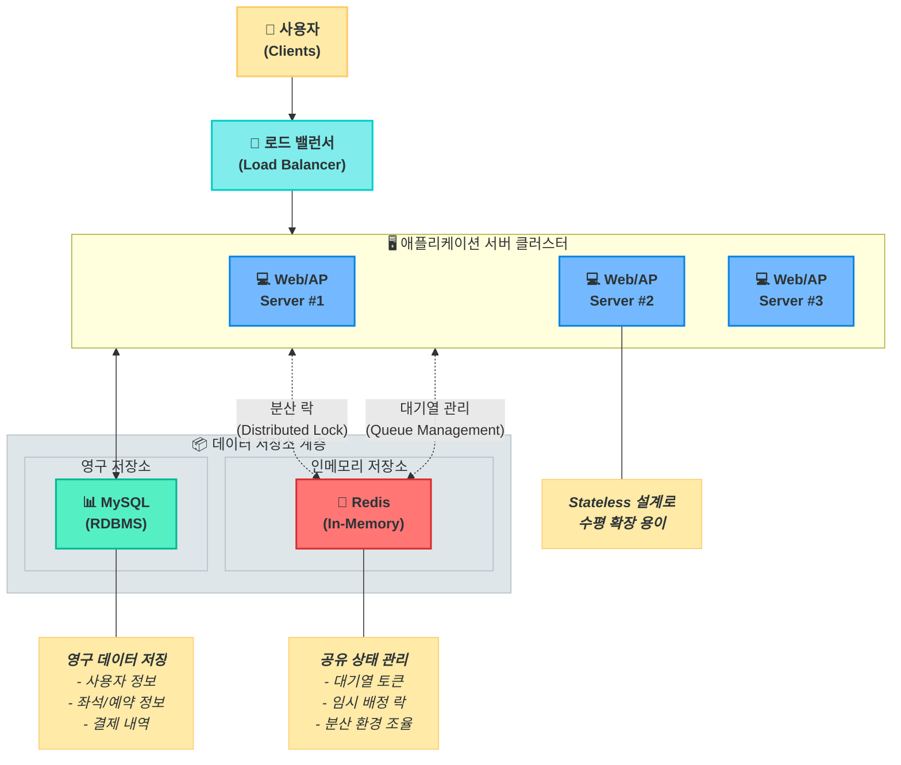

# 3. 시스템 아키텍처 & 컴포넌트

## 1. 시스템 아키텍처 개요

본 시스템은 '오버엔지니어링 금지' 원칙 하에, 요구사항을 만족시키는 가장 단순하고 효율적인 아키텍처를 채택합니다. '다수 인스턴스 환경'에서의 상태 공유 및 동시성 제어를 위해 **Redis**를 핵심 보조 컴포넌트로 활용합니다.

## 2. 주요 컴포넌트

### 2.1. Web/AP Server (Application)
-   **역할:** 비즈니스 로직 처리 및 API 제공
-   **설명:** Stateless하게 설계하여 수평 확장이 용이하도록 합니다. 실제 상태(대기열, 좌석 잠금 정보)는 Redis에 위임하여 여러 인스턴스가 동일한 상태를 공유합니다.

### 2.2. RDBMS (e.g., MySQL, PostgreSQL)
-   **역할:** 핵심 데이터의 영구 저장
-   **설명:** 사용자 정보, 잔액, 콘서트/좌석 정보, 최종 확정된 예약 및 결제 내역 등 트랜잭션과 데이터 무결성이 중요한 정보를 저장합니다.

### 2.3. Redis
-   **역할:** 대기열 관리 및 분산 락(Distributed Lock)
-   **설명:** 이 컴포넌트의 도입은 오버엔지니어링이 아닙니다. 다수 인스턴스 환경에서 상태를 공유하고 빠른 속도로 동시성을 제어해야 하는 요구사항을 만족시키기 위한 필수적인 선택입니다.
    -   **대기열 구현:** Redis의 **Sorted Set**을 사용하여 `(입장 요청 시간, 유저 UUID)`를 저장합니다. Score를 시간으로 사용하여 공정한 순서를 보장하고, 주기적으로 일정 수의 사용자를 활성 상태로 전환합니다.
    -   **분산 락 구현:** Redis의 `SET key value NX` 명령어를 활용하여 좌석에 대한 분산 락을 구현합니다. `lock:seat:{seatId}` 와 같은 키를 사용하여 특정 좌석에 대한 선점을 제어합니다.

### 2.4. Scheduler
-   **역할:** 주기적인 상태 업데이트
-   **설명:** 애플리케이션 내 스케줄러(e.g., Spring `@Scheduled`)를 사용하여 다음 작업을 수행합니다.
    -   만료된 좌석 임시 배정(락)을 확인하고 자동으로 해제합니다.
    -   대기열을 확인하여 다음 순번의 사용자들을 활성 상태로 전환합니다.
