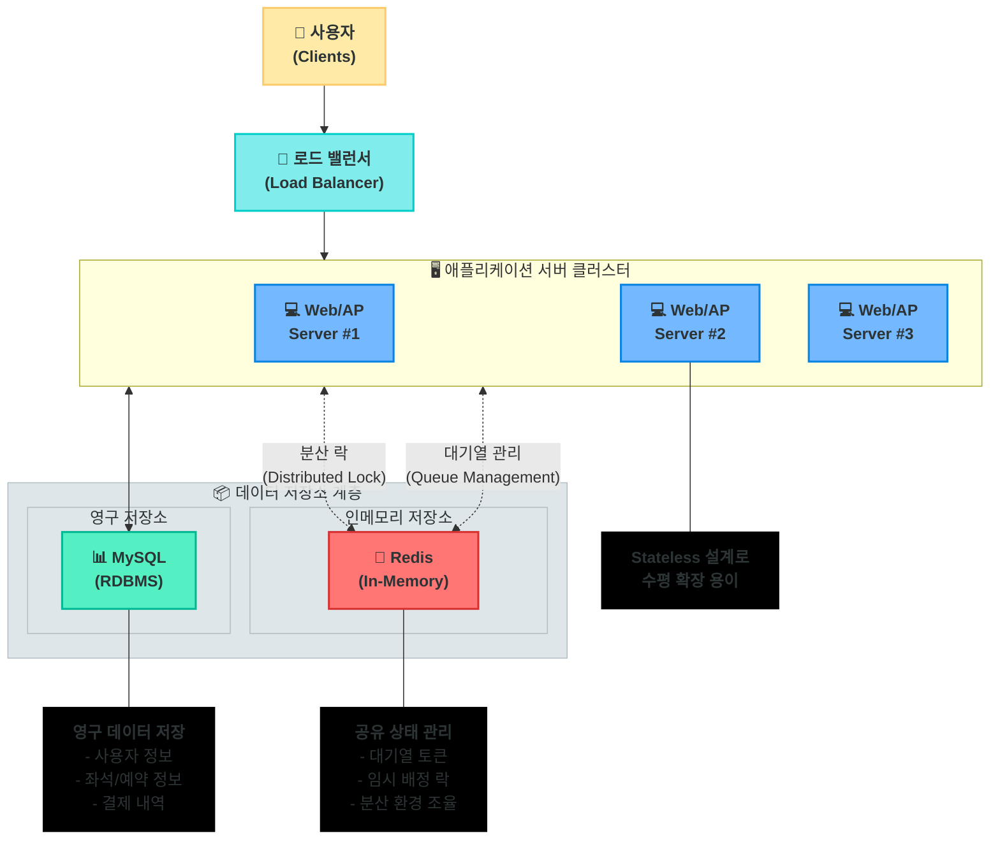

# 3. 시스템 아키텍처 & 컴포넌트

## 1. 시스템 아키텍처 개요

본 시스템은 '오버엔지니어링 금지' 원칙 하에, 요구사항을 만족시키는 가장 단순하고 효율적인 아키텍처를 채택합니다. '다수 인스턴스 환경'에서의 상태 공유 및 동시성 제어를 위해 **Redis**를 핵심 보조 컴포넌트로 활용합니다.



## 2. 컴포넌트 역할 및 기능

| 컴포넌트 | 주요 역할 | 기술 스택 | 확장성 |
|---------|-----------|-----------|--------|
| **웹/AP 서버** | • 비즈니스 로직 처리<br>• API 제공<br>• 인증/인가 관리 | • Spring Boot<br>• Kotlin/Java | • 수평 확장 가능<br>• Stateless 설계 |
| **RDBMS** | • 영구 데이터 저장<br>• 트랜잭션 처리<br>• 데이터 일관성 유지 | • MySQL/PostgreSQL<br>• JPA/Hibernate | • Master-Slave 구성<br>• 데이터 샤딩 고려 |
| **Redis** | • 대기열 관리<br>• 분산 락 제공<br>• 일시적 상태 관리 | • Redis<br>• Redisson/Lettuce | • 클러스터 구성<br>• Sentinel 모니터링 |
| **Load Balancer** | • 트래픽 분산<br>• 헬스 체크<br>• 장애 서버 제외 | • Nginx<br>• AWS ELB/ALB | • Auto-Scaling 연동<br>• Session Affinity 지원 |

## 3. 주요 컴포넌트 상세 설명

### 3.1. 웹/AP 서버 (Application)

**역할:** 비즈니스 로직 처리 및 API 제공

**핵심 특징:**
- **Stateless 설계**: 서버 자체는 상태를 저장하지 않고, 필요한 상태 정보는 Redis와 DB에 위임
- **수평 확장 용이**: 언제든 인스턴스 추가만으로 처리 용량 확장 가능
- **로드 밸런싱**: 라운드 로빈 또는 최소 연결 기반 부하 분산

**주요 모듈:**
1. **대기열 토큰 관리**: 토큰 발급, 검증, 대기열 위치 관리
2. **좌석 예약 처리**: 좌석 조회, 임시 배정, 상태 관리
3. **결제 처리**: 잔액 검증, 결제 수행, 소유권 영구 배정

### 3.2. RDBMS (MySQL/PostgreSQL)

**역할:** 핵심 데이터의 영구 저장

**저장 데이터:**
- 사용자 정보, 잔액
- 콘서트/좌석 정보
- 예약 및 결제 내역

**특징:**
- **트랜잭션 지원**: ACID 속성을 통한 데이터 무결성 보장
- **관계형 모델**: 엔티티 간 관계를 명확히 표현
- **백업 및 복구**: 정기적인 백업을 통한 데이터 보호

### 3.3. Redis (In-Memory Store)

**역할:** 대기열 관리 및 분산 락(Distributed Lock)

**핵심 구현:**
1. **대기열 구현 (Sorted Set)**:
   ```
   # 유저 대기열 등록
   ZADD "waiting-queue" {timestamp} {userId}
   
   # 활성 상태로 전환할 사용자 조회 (상위 N명)
   ZRANGE "waiting-queue" 0 {activeLimit-1}
   
   # 활성화된 사용자를 별도 Set에 저장
   SADD "active-users" {userId}
   ```

2. **분산 락 구현 (SET NX + Expiry)**:
   ```
   # 좌석 락 획득 시도
   SET "lock:seat:{seatId}" {userId} NX PX 3000
   
   # 비즈니스 로직 수행...
   
   # 작업 완료 후 락 해제
   DEL "lock:seat:{seatId}"
   ```

**장점:**
- **성능**: 메모리 기반 고속 처리로 대기열 및 락 작업 지연 최소화
- **원자성**: Redis의 단일 스레드 특성으로 분산 환경에서도 원자적 연산 보장
- **TTL 기능**: 키에 만료 시간을 설정하여 비정상 종료 시에도 자동 정리

### 3.4. 스케줄러 (Scheduler)

**역할:** 주기적인 상태 업데이트

**주요 작업:**
- **만료 예약 처리**: 5분이 경과한 임시 배정 좌석 자동 해제
- **대기열 관리**: 대기열에서 다음 사용자를 활성 상태로 전환

**구현 방식:**
- 애플리케이션 내 스케줄러(Spring `@Scheduled`) 활용
- 분산 환경에서는 Redis 기반 락을 활용하여 중복 실행 방지
