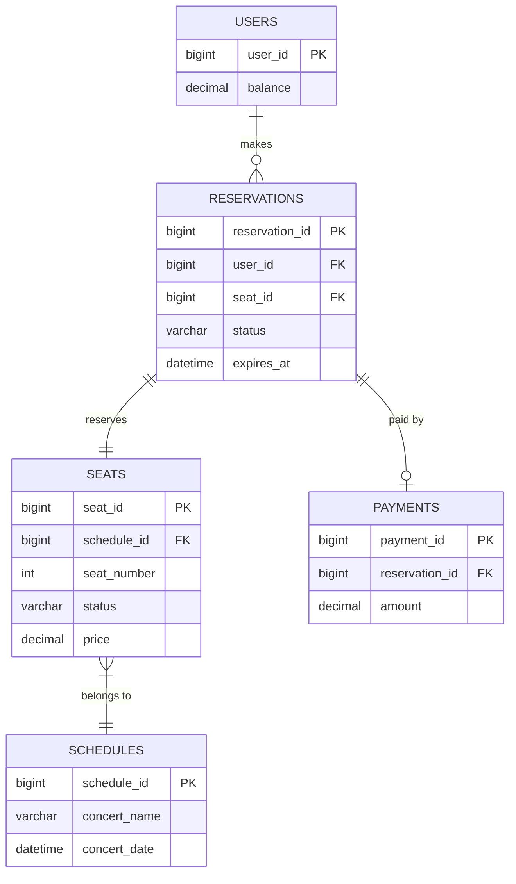

# 4. 데이터 모델(ERD) & 스키마

## 1. ERD (Entity Relationship Diagram)

## 2. 테이블 스키마

### USERS
-   사용자 정보와 잔액을 관리합니다.
-   `user_id` (PK, BIGINT): 사용자 식별자
-   `balance` (DECIMAL): 사용자 충전 잔액

### SCHEDULES
-   콘서트 날짜 정보를 관리합니다.
-   `schedule_id` (PK, BIGINT): 스케줄 식별자
-   `concert_name` (VARCHAR): 콘서트 이름
-   `concert_date` (DATETIME): 콘서트 날짜

### SEATS
-   각 스케줄에 할당된 좌석 정보를 관리합니다.
-   `seat_id` (PK, BIGINT): 좌석 식별자
-   `schedule_id` (FK, BIGINT): 스케줄 FK
-   `seat_number` (INT): 좌석 번호 (1-50)
-   `status` (VARCHAR): 좌석 상태 (`AVAILABLE`, `RESERVED`, `SOLD`)
-   `price` (DECIMAL): 좌석 가격

### RESERVATIONS
-   사용자의 임시 예약 정보를 관리합니다.
-   `reservation_id` (PK, BIGINT): 예약 식별자
-   `user_id` (FK, BIGINT): 사용자 FK
-   `seat_id` (FK, BIGINT): 좌석 FK
-   `status` (VARCHAR): 예약 상태 (`PENDING`, `PAID`, `EXPIRED`)
-   `expires_at` (DATETIME): 임시 배정 만료 시간 (생성 시간 + 5분)

### PAYMENTS
-   결제 완료 내역을 관리합니다.
-   `payment_id` (PK, BIGINT): 결제 식별자
-   `reservation_id` (FK, BIGINT): 예약 FK
-   `amount` (DECIMAL): 결제 금액
