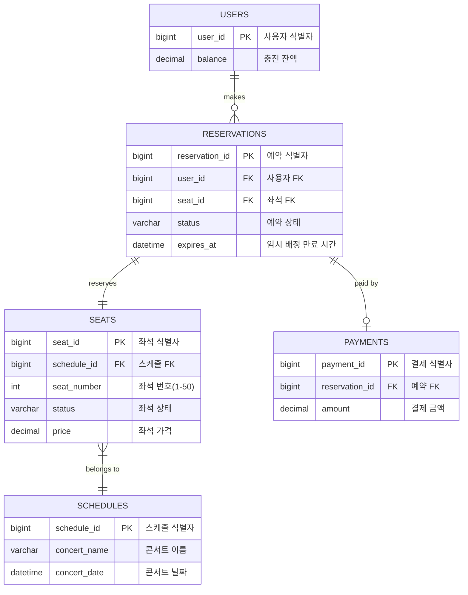

# 4. 데이터 모델(ERD) & 스키마

## 1. ERD (Entity Relationship Diagram)

## 2. 테이블 관계 설명

### 핵심 관계 개요

```mermaid
graph LR
    classDef userClass fill:#000000,stroke:#000000,stroke-width:2px
    classDef scheduleClass fill:#000000,stroke:#000000,stroke-width:2px
    classDef seatClass fill:#000000,stroke:#000000,stroke-width:2px
    classDef reservClass fill:#000000,stroke:#000000,stroke-width:2px
    classDef paymentClass fill:#000000,stroke:#000000,stroke-width:2px
    
    U[사용자]:::userClass --> |1:N| R[예약]:::reservClass
    S[스케줄]:::scheduleClass --> |1:N| ST[좌석]:::seatClass
    ST --> |1:1| R
    R --> |1:0..1| P[결제]:::paymentClass
```

### 테이블 간 관계 상세

| 관계 | 설명 | 제약 사항 |
|------|------|----------|
| **USERS ↔ RESERVATIONS** | 한 사용자는 여러 예약을 할 수 있습니다. | `RESERVATIONS.user_id`는 `USERS.user_id`를 참조합니다.  사용자가 삭제되면 해당 예약 정보도 함께 삭제되어야 합니다. |
| **SCHEDULES ↔ SEATS** | 한 콘서트 스케줄은 여러 좌석을 가집니다. | `SEATS.schedule_id`는 `SCHEDULES.schedule_id`를 참조합니다.  스케줄이 삭제되면 연관된 좌석 정보도 함께 삭제되어야 합니다. |
| **SEATS ↔ RESERVATIONS** | 한 좌석은 한 번에 하나의 예약만 가능합니다. | `RESERVATIONS.seat_id`는 `SEATS.seat_id`를 참조합니다.  좌석의 `status` 값이 변경되면 해당 변경 사항이 반영되어야 합니다. |
| **RESERVATIONS ↔ PAYMENTS** | 하나의 예약은 최대 하나의 결제 정보를 가질 수 있습니다. | `PAYMENTS.reservation_id`는 `RESERVATIONS.reservation_id`를 참조하며 UNIQUE 제약이 있습니다.  예약이 삭제되면 연관된 결제 정보도 함께 삭제되어야 합니다. |

### 주요 비즈니스 규칙

1. **좌석 예약 시 상태 전이**:
   - 좌석이 예약되면 `SEATS.status`는 `AVAILABLE` → `RESERVED`로 변경됩니다.
   - 결제가 완료되면 `SEATS.status`는 `RESERVED` → `SOLD`로, `RESERVATIONS.status`는 `PENDING` → `PAID`로 변경됩니다.
   - 예약 시간이 만료되면 `SEATS.status`는 `RESERVED` → `AVAILABLE`로, `RESERVATIONS.status`는 `PENDING` → `EXPIRED`로 변경됩니다.

2. **데이터 정합성 제약**:
   - 임시 배정 상태(`RESERVATIONS.status = 'PENDING'`)인 좌석(`SEATS.status = 'RESERVED'`)은 다른 사용자가 예약할 수 없습니다.
   - 한 좌석에 대해 동시에 여러 건의 `PENDING` 상태 예약이 존재할 수 없습니다.
   - 결제(`PAYMENTS`)는 `PENDING` 상태의 예약에 대해서만 생성될 수 있습니다.

### 📋 USERS
사용자 정보와 잔액을 관리합니다.

| 필드명 | 타입 | 제약조건 | 설명 |
|-------|------|---------|------|
| `user_id` | BIGINT | PK | 사용자 식별자 |
| `balance` | DECIMAL | NOT NULL, DEFAULT 0 | 사용자 충전 잔액 |

### 🗓️ SCHEDULES
콘서트 날짜 정보를 관리합니다.

| 필드명 | 타입 | 제약조건 | 설명 |
|-------|------|---------|------|
| `schedule_id` | BIGINT | PK | 스케줄 식별자 |
| `concert_name` | VARCHAR(100) | NOT NULL | 콘서트 이름 |
| `concert_date` | DATETIME | NOT NULL | 콘서트 날짜 |

### 💺 SEATS
각 스케줄에 할당된 좌석 정보를 관리합니다.

| 필드명 | 타입 | 제약조건 | 설명 |
|-------|------|---------|------|
| `seat_id` | BIGINT | PK | 좌석 식별자 |
| `schedule_id` | BIGINT | FK(SCHEDULES) | 스케줄 FK |
| `seat_number` | INT | NOT NULL | 좌석 번호 (1-50) |
| `status` | VARCHAR(20) | NOT NULL | 좌석 상태 (`AVAILABLE`, `RESERVED`, `SOLD`) |
| `price` | DECIMAL | NOT NULL | 좌석 가격 |

### 🔖 RESERVATIONS
사용자의 임시 예약 정보를 관리합니다.

| 필드명 | 타입 | 제약조건 | 설명 |
|-------|------|---------|------|
| `reservation_id` | BIGINT | PK | 예약 식별자 |
| `user_id` | BIGINT | FK(USERS) | 사용자 FK |
| `seat_id` | BIGINT | FK(SEATS) | 좌석 FK |
| `status` | VARCHAR(20) | NOT NULL | 예약 상태 (`PENDING`, `PAID`, `EXPIRED`) |
| `expires_at` | DATETIME | NOT NULL | 임시 배정 만료 시간 (생성 시간 + 5분) |

### 💳 PAYMENTS
결제 완료 내역을 관리합니다.

| 필드명 | 타입 | 제약조건 | 설명 |
|-------|------|---------|------|
| `payment_id` | BIGINT | PK | 결제 식별자 |
| `reservation_id` | BIGINT | FK(RESERVATIONS), UNIQUE | 예약 FK |
| `amount` | DECIMAL | NOT NULL | 결제 금액 |

## 3. 상태 코드 정의

### 좌석 상태 (SEATS.status)
- **AVAILABLE**: 예약 가능한 상태
- **RESERVED**: 임시 배정된 상태 (5분간 유지)
- **SOLD**: 결제 완료되어 판매된 상태

### 예약 상태 (RESERVATIONS.status)
- **PENDING**: 임시 예약 상태 (결제 대기)
- **PAID**: 결제 완료 상태
- **EXPIRED**: 결제 시간 초과로 만료된 상태

