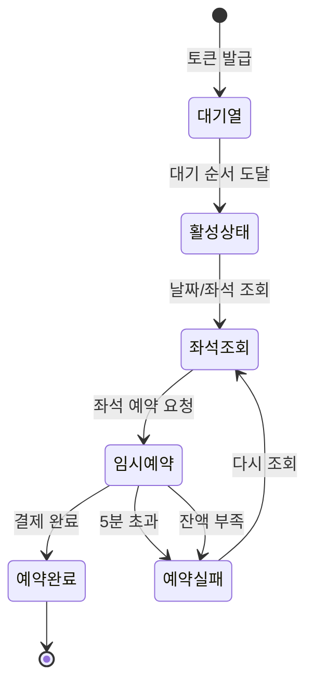

# 5. API 문서

## 📌 공통 사항

### 인증
- **토큰 기반 인증**: `1. 유저 토큰 발급 API`를 제외한 모든 API는 HTTP Header에 인증 토큰을 포함해야 합니다.
  ```
  Authorization: Bearer {대기열_토큰}
  ```
- **토큰 검증**: 서버는 토큰을 검증하여 활성 상태의 사용자인지 확인합니다.

### 응답 형식
- 모든 API 응답은 JSON 형식으로 반환됩니다.
- 성공 응답은 HTTP 상태 코드 2xx와 함께 반환됩니다.
- 오류 응답은 적절한 HTTP 상태 코드와 오류 메시지를 포함합니다.

---

## 🔑 1. 유저 토큰 발급 API

### 기본 정보
| 항목 | 내용 |
|------|------|
| **Endpoint** | `POST /api/tokens` |
| **Description** | 서비스 이용을 위한 대기열 토큰을 발급받습니다. 대기열에 진입하는 시점입니다. |
| **Auth Required** | No |

### Request

#### Body
```json
{
  "userId": "user-uuid-123"
}
```

### Response

#### Success (200 OK)
```json
{
  "token": "대기열_JWT_토큰",
  "status": "WAITING",  // or "ACTIVE"
  "rank": 150,          // 대기 순번
  "expiresIn": 3600     // 토큰 만료 시간(초)
}
```

---

## 🗓️ 2. 예약 가능 날짜 / 좌석 조회 API

### 날짜 목록 조회

#### 기본 정보
| 항목 | 내용 |
|------|------|
| **Endpoint** | `GET /api/concerts/dates` |
| **Description** | 예약 가능한 날짜 목록을 조회합니다. |
| **Auth Required** | Yes |

#### Response

##### Success (200 OK)
```json
{
  "dates": [
    {
      "scheduleId": 1,
      "concertName": "2025 여름 콘서트",
      "concertDate": "2025-07-15T19:00:00Z"
    },
    {
      "scheduleId": 2,
      "concertName": "2025 여름 콘서트",
      "concertDate": "2025-07-16T19:00:00Z"
    }
  ]
}
```

### 좌석 목록 조회

#### 기본 정보
| 항목 | 내용 |
|------|------|
| **Endpoint** | `GET /api/concerts/{scheduleId}/seats` |
| **Description** | 특정 날짜의 좌석 상태를 조회합니다. |
| **Auth Required** | Yes |

#### Parameters
| 이름 | 위치 | 타입 | 필수 | 설명 |
|------|------|------|------|------|
| `scheduleId` | path | integer | Yes | 콘서트 스케줄 ID |

#### Response

##### Success (200 OK)
```json
{
  "seats": [
    { "seatNumber": 1, "status": "AVAILABLE", "price": 100000 },
    { "seatNumber": 2, "status": "RESERVED", "price": 100000 },
    { "seatNumber": 3, "status": "SOLD", "price": 100000 }
  ]
}
```

> **좌석 상태 코드**:
> - `AVAILABLE`: 예약 가능
> - `RESERVED`: 임시 배정 상태
> - `SOLD`: 판매 완료

---

## 💺 3. 좌석 예약 요청 API

### 기본 정보
| 항목 | 내용 |
|------|------|
| **Endpoint** | `POST /api/reservations` |
| **Description** | 좌석을 5분간 임시로 예약(선점)합니다. |
| **Auth Required** | Yes |

### Request

#### Body
```json
{
  "scheduleId": 1,
  "seatNumber": 1
}
```

### Response

#### Success (200 OK)
```json
{
  "reservationId": 123,
  "seatNumber": 1,
  "status": "PENDING",
  "expiresAt": "2023-10-27T15:05:00Z"
}
```

#### Error (409 Conflict)
```json
{
  "message": "이미 배정된 좌석입니다."
}
```

---

## 💰 4. 잔액 충전 / 조회 API

### 잔액 충전

#### 기본 정보
| 항목 | 내용 |
|------|------|
| **Endpoint** | `PATCH /api/users/balance` |
| **Description** | 사용자 잔액을 충전합니다. |
| **Auth Required** | Yes |

#### Request

##### Body
```json
{
  "amount": 50000
}
```

#### Response

##### Success (200 OK)
```json
{
  "balance": 150000,
  "message": "충전이 완료되었습니다."
}
```

### 잔액 조회

#### 기본 정보
| 항목 | 내용 |
|------|------|
| **Endpoint** | `GET /api/users/balance` |
| **Description** | 사용자 잔액을 조회합니다. |
| **Auth Required** | Yes |

#### Response

##### Success (200 OK)
```json
{
  "balance": 150000
}
```

---

## 💳 5. 결제 API

### 기본 정보
| 항목 | 내용 |
|------|------|
| **Endpoint** | `POST /api/payments` |
| **Description** | 임시 배정된 예약 건을 결제하여 최종 확정합니다. |
| **Auth Required** | Yes |

### Request

#### Body
```json
{
  "reservationId": 123
}
```

### Response

#### Success (200 OK)
```json
{
  "paymentId": 456,
  "message": "결제가 성공적으로 완료되었습니다."
}
```

#### Error (400 Bad Request)
```json
{
  "message": "잔액이 부족합니다."
}
```
```json
{
  "message": "예약이 만료되었습니다."
}
```

---

## 🔄 상태 전이 다이어그램


