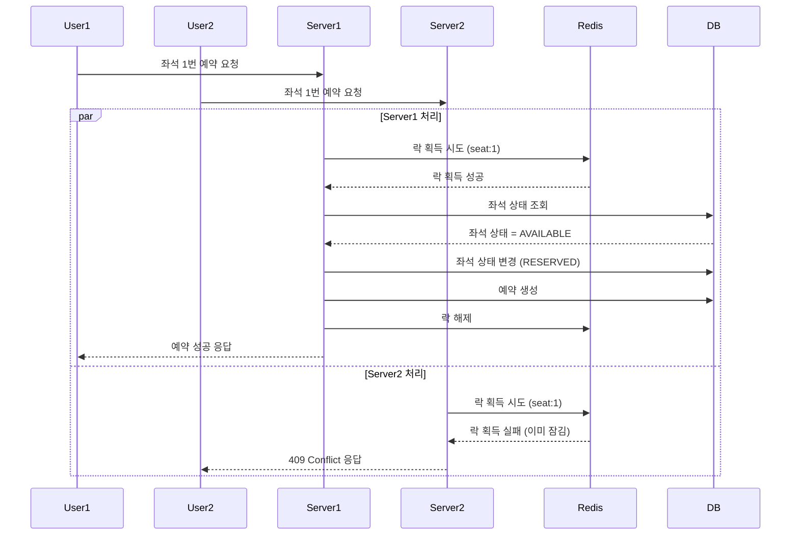
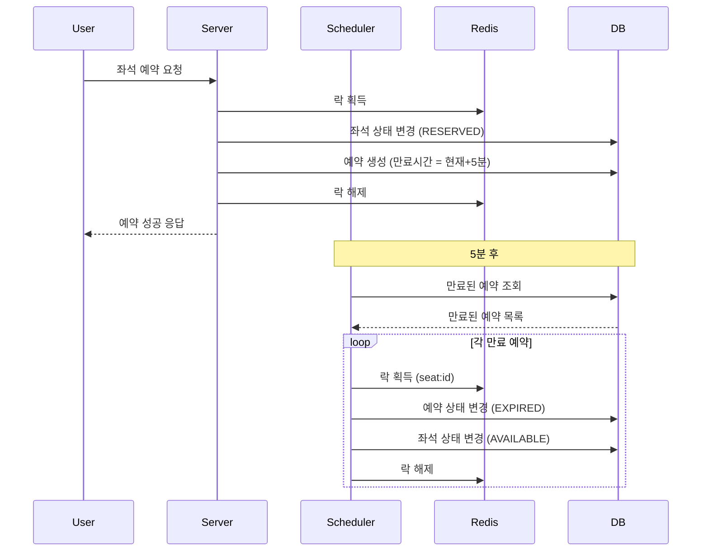

# 6. 동시성 & 트랜잭션 시나리오

## 1. 개요

이 문서는 콘서트 예약 서비스에서 발생할 수 있는 동시성 문제와 그 해결책을 구체적인 시나리오와 예시 코드를 통해 설명합니다. 실제 구현 시 참고할 수 있는 실용적인 가이드를 제공합니다.

## 2. 주요 동시성 문제

### 2.1 좌석 중복 예약 문제



### 2.2 임시 배정 만료 문제



## 3. Redis 기반 분산 락 구현

### 3.1 분산 락 메커니즘

Redis의 `SET key value NX PX milliseconds` 명령어를 활용하여 원자적으로 락을 획득하고 자동 만료 시간을 설정합니다.

#### 락 획득 및 해제 인터페이스 (출력 포트)

```kotlin
// application/port/out/LockPort.kt
interface LockPort {
    /**
     * 분산 락 획득 시도
     * @param resourceId 락을 걸 리소스 식별자 (예: "seat:1")
     * @param ownerId 락 소유자 식별자 (예: 사용자 ID)
     * @param ttlMillis 락 유효 시간 (밀리초)
     * @return 락 획득 성공 여부
     */
    fun acquireLock(resourceId: String, ownerId: String, ttlMillis: Long): Boolean
    
    /**
     * 분산 락 해제
     * @param resourceId 락을 해제할 리소스 식별자
     * @param ownerId 락 소유자 식별자 (소유자만 해제 가능)
     * @return 락 해제 성공 여부
     */
    fun releaseLock(resourceId: String, ownerId: String): Boolean
}
```

#### Redis 기반 분산 락 어댑터 구현

```kotlin
// adapter/out/redis/RedisLockAdapter.kt
@Component
class RedisLockAdapter(
    private val redisTemplate: StringRedisTemplate
) : LockPort {
    
    override fun acquireLock(resourceId: String, ownerId: String, ttlMillis: Long): Boolean {
        val key = "lock:$resourceId"
        val script = """
            return redis.call('set', KEYS[1], ARGV[1], 'NX', 'PX', ARGV[2])
        """
        
        val result = redisTemplate.execute(
            RedisScript.of(script, Boolean::class.java),
            listOf(key),
            ownerId,
            ttlMillis.toString()
        )
        
        return result == true
    }
    
    override fun releaseLock(resourceId: String, ownerId: String): Boolean {
        val key = "lock:$resourceId"
        val script = """
            if redis.call('get', KEYS[1]) == ARGV[1] then
                return redis.call('del', KEYS[1])
            else
                return 0
            end
        """
        
        val result = redisTemplate.execute(
            RedisScript.of(script, Long::class.java),
            listOf(key),
            ownerId
        )
        
        return result == 1L
    }
}
```

## 4. 좌석 예약 동시성 제어 구현

### 4.1 좌석 예약 유스케이스

```kotlin
// application/service/ReservationService.kt
@Service
@Transactional
class ReservationService(
    private val seatRepository: SeatRepository,
    private val reservationRepository: ReservationRepository,
    private val lockPort: LockPort
) : ReservationUseCase {
    
    override fun reserveSeat(userId: String, scheduleId: Long, seatNumber: Int): ReservationResult {
        val lockKey = "seat:$scheduleId:$seatNumber"
        val lockTtl = 3000L // 3초
        
        // 1. 분산 락 획득 시도
        val lockAcquired = lockPort.acquireLock(lockKey, userId, lockTtl)
        if (!lockAcquired) {
            return ReservationResult.failed("좌석을 일시적으로 사용할 수 없습니다. 다시 시도해주세요.")
        }
        
        try {
            // 2. 좌석 상태 확인
            val seat = seatRepository.findBySeatNumberAndScheduleId(seatNumber, scheduleId)
                ?: return ReservationResult.failed("존재하지 않는 좌석입니다.")
            
            if (seat.status != SeatStatus.AVAILABLE) {
                return ReservationResult.failed("이미 예약된 좌석입니다.")
            }
            
            // 3. 좌석 상태 변경 및 예약 생성
            seat.status = SeatStatus.RESERVED
            seatRepository.save(seat)
            
            val expiresAt = LocalDateTime.now().plusMinutes(5) // 5분 후 만료
            val reservation = Reservation(
                userId = userId,
                seatId = seat.id,
                status = ReservationStatus.PENDING,
                expiresAt = expiresAt
            )
            
            val savedReservation = reservationRepository.save(reservation)
            
            return ReservationResult.success(savedReservation.id)
        } finally {
            // 4. 락 해제 (finally 블록에서 항상 실행)
            lockPort.releaseLock(lockKey, userId)
        }
    }
}
```

## 5. 대기열 시스템 구현

### 5.1 Redis Sorted Set을 활용한 대기열 구현

```kotlin
// adapter/out/redis/RedisQueueAdapter.kt
@Component
class RedisQueueAdapter(
    private val redisTemplate: StringRedisTemplate
) : QueuePort {
    
    private val waitingQueueKey = "waiting-queue"
    private val activeUsersKey = "active-users"
    
    override fun addToQueue(userId: String): Long {
        val score = System.currentTimeMillis().toDouble()
        redisTemplate.opsForZSet().add(waitingQueueKey, userId, score)
        
        // 현재 대기 순번 반환
        return redisTemplate.opsForZSet().rank(waitingQueueKey, userId) ?: -1L
    }
    
    override fun processQueue(activeLimit: Int): Int {
        val ops = redisTemplate.opsForZSet()
        
        // 현재 활성 사용자 수 확인
        val activeCount = redisTemplate.opsForSet().size(activeUsersKey) ?: 0
        
        // 추가로 활성화할 수 있는 사용자 수
        val remainingSlots = activeLimit - activeCount.toInt()
        if (remainingSlots <= 0) {
            return 0
        }
        
        // 대기열에서 상위 N명 조회
        val waitingUsers = ops.range(waitingQueueKey, 0, remainingSlots - 1.toLong())
            ?: return 0
        
        // 활성 사용자로 추가
        val pipeline = redisTemplate.connectionFactory!!.connection.createPipeline()
        waitingUsers.forEach { userId ->
            redisTemplate.opsForSet().add(activeUsersKey, userId)
            ops.remove(waitingQueueKey, userId)
        }
        pipeline.close()
        
        return waitingUsers.size
    }
    
    override fun isUserActive(userId: String): Boolean {
        return redisTemplate.opsForSet().isMember(activeUsersKey, userId) ?: false
    }
    
    override fun deactivateUser(userId: String) {
        redisTemplate.opsForSet().remove(activeUsersKey, userId)
    }
}
```

## 6. 임시 배정 좌석 만료 처리

### 6.1 스케줄러 구현

```kotlin
// adapter/out/scheduler/ReservationExpiryScheduler.kt
@Component
class ReservationExpiryScheduler(
    private val reservationRepository: ReservationRepository,
    private val seatRepository: SeatRepository,
    private val lockPort: LockPort
) {
    
    private val log = LoggerFactory.getLogger(javaClass)
    
    @Scheduled(fixedRate = 60000) // 1분마다 실행
    fun processExpiredReservations() {
        log.info("임시 예약 만료 처리 시작")
        
        // 만료된 예약 조회
        val expiredReservations = reservationRepository
            .findByStatusAndExpiresAtBefore(ReservationStatus.PENDING, LocalDateTime.now())
        
        log.info("만료 대상 예약: ${expiredReservations.size}건")
        
        // 각 예약에 대해 만료 처리
        for (reservation in expiredReservations) {
            val seat = seatRepository.findById(reservation.seatId).orElse(null) ?: continue
            val lockKey = "seat:${seat.scheduleId}:${seat.seatNumber}"
            
            // 락 획득
            if (lockPort.acquireLock(lockKey, "scheduler", 3000)) {
                try {
                    // 상태 변경이 필요한지 재확인 (다른 스케줄러와의 경쟁 조건 방지)
                    if (reservation.status == ReservationStatus.PENDING) {
                        // 트랜잭션 내에서 상태 변경
                        reservation.status = ReservationStatus.EXPIRED
                        seat.status = SeatStatus.AVAILABLE
                        
                        reservationRepository.save(reservation)
                        seatRepository.save(seat)
                        
                        log.info("예약 ID ${reservation.id} 만료 처리 완료")
                    }
                } finally {
                    // 락 해제
                    lockPort.releaseLock(lockKey, "scheduler")
                }
            } else {
                log.warn("락 획득 실패: ${lockKey}")
            }
        }
        
        log.info("임시 예약 만료 처리 완료")
    }
}
```

## 7. 트랜잭션 관리 전략

### 7.1 트랜잭션 경계 정의

- **애플리케이션 서비스**: 비즈니스 로직을 포함하는 서비스 계층에 트랜잭션 경계 설정
- **작은 트랜잭션**: 가능한 트랜잭션 범위를 작게 유지하여 락 경합 최소화
- **일관성 보장**: 좌석 상태와 예약 상태 변경은 단일 트랜잭션 내에서 처리

### 7.2 데드락 방지 전략

- **락 획득 순서 일관성**: 항상 동일한 순서로 락 획득 (e.g., 항상 좌석 락을 먼저 획득)
- **락 타임아웃 설정**: 모든 락에 타임아웃 설정하여 무한 대기 방지
- **재시도 로직**: 락 획득 실패 시 백오프 전략을 적용한 재시도 로직 구현

```kotlin
// 재시도 로직 예시
fun <T> withRetry(
    maxAttempts: Int = 3,
    initialBackoffMillis: Long = 100,
    operation: () -> T
): T {
    var attempt = 0
    var backoffMillis = initialBackoffMillis
    
    while (true) {
        attempt++
        try {
            return operation()
        } catch (e: Exception) {
            if (attempt >= maxAttempts) {
                throw e
            }
            
            // 지수 백오프 적용
            Thread.sleep(backoffMillis)
            backoffMillis *= 2
        }
    }
}
```
