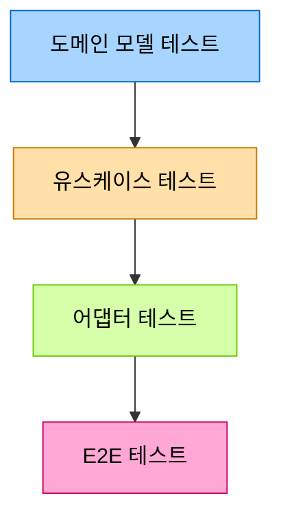

# 7. 테스트 전략

## 1. 테스트 개요

이 문서는 콘서트 예약 서비스의 핵심 기능을 검증하기 위한 테스트 전략을 설명합니다. 헥사고날 아키텍처 특성을 활용하여 각 계층별로 효과적인 테스트를 구성합니다.

## 2. 테스트 유형 및 목적

| 테스트 유형 | 설명 | 목적 | 툴/프레임워크 |
|------------|-----|------|--------------|
| **단위 테스트** | 개별 클래스/메서드 기능 검증 | 비즈니스 로직 정확성 확인 | JUnit 5, Mockito |
| **통합 테스트** | 여러 컴포넌트 간 상호작용 검증 | 시스템 통합 동작 확인 | JUnit 5, TestContainers |
| **동시성 테스트** | 동시 요청 처리 검증 | 동시성 제어 메커니즘 확인 | JUnit 5, CountDownLatch |

## 3. 헥사고날 아키텍처 기반 테스트 전략



### 3.1 도메인 모델 테스트

- **대상**: 엔티티, 값 객체, 도메인 서비스
- **목적**: 핵심 비즈니스 규칙 검증
- **모킹**: 외부 의존성 없음 (순수 도메인 모델)

#### 예시 코드
```kotlin
@Test
fun `임시 예약 상태의 좌석은 예약 가능 상태로 만료되어야 한다`() {
    // Given
    val seat = Seat(id = 1, status = SeatStatus.RESERVED)
    val reservation = Reservation(
        id = 1,
        seatId = seat.id,
        status = ReservationStatus.PENDING,
        expiresAt = LocalDateTime.now().minusMinutes(1)
    )
    
    // When
    val expired = reservationService.checkAndExpireReservation(reservation, seat)
    
    // Then
    assertTrue(expired)
    assertEquals(SeatStatus.AVAILABLE, seat.status)
    assertEquals(ReservationStatus.EXPIRED, reservation.status)
}
```

### 3.2 유스케이스(애플리케이션 서비스) 테스트

- **대상**: 애플리케이션 서비스, 유스케이스 구현체
- **목적**: 비즈니스 로직 오케스트레이션 검증
- **모킹**: 출력 포트 (저장소, 분산 락 등)

#### 예시 코드
```kotlin
@Test
fun `좌석 예약 시 분산 락을 획득하고 예약을 생성해야 한다`() {
    // Given
    val userId = "user123"
    val seatId = 1L
    val scheduleId = 1L
    
    // 출력 포트 모킹
    given(lockPort.acquireLock(any(), any(), any())).willReturn(true)
    given(seatRepository.findBySeatNumberAndScheduleId(any(), any()))
        .willReturn(Seat(id = seatId, status = SeatStatus.AVAILABLE))
    
    // When
    val result = reservationUseCase.reserveSeat(userId, scheduleId, 1)
    
    // Then
    assertTrue(result.isSuccess)
    verify(lockPort).acquireLock(eq("seat:$scheduleId:1"), eq(userId), any())
    verify(reservationRepository).save(any())
    verify(lockPort).releaseLock(eq("seat:$scheduleId:1"), eq(userId))
}
```

### 3.3 어댑터 테스트

- **대상**: 컨트롤러, 레포지토리 구현체, Redis 어댑터
- **목적**: 외부 시스템과의 통합 검증
- **모킹**: 최소화 (실제 인프라 사용 권장)

#### 예시 코드 (컨트롤러)
```kotlin
@WebMvcTest(ReservationController::class)
class ReservationControllerTest {
    
    @MockBean
    private lateinit var reservationUseCase: ReservationUseCase
    
    @Autowired
    private lateinit var mockMvc: MockMvc
    
    @Test
    fun `좌석 예약 API 호출 시 유효한 요청이면 성공 응답을 반환한다`() {
        // Given
        val request = ReservationRequest(scheduleId = 1, seatNumber = 1)
        given(reservationUseCase.reserveSeat(any(), any(), any()))
            .willReturn(ReservationResult.success(reservationId = 123))
        
        // When & Then
        mockMvc.perform(post("/api/reservations")
            .header("Authorization", "Bearer valid-token")
            .contentType(MediaType.APPLICATION_JSON)
            .content(ObjectMapper().writeValueAsString(request)))
            .andExpect(status().isOk)
            .andExpect(jsonPath("$.reservationId").value(123))
    }
}
```

#### 예시 코드 (Redis 어댑터)
```kotlin
@SpringBootTest
class RedisLockAdapterTest {
    
    @Autowired
    private lateinit var redisLockAdapter: RedisLockAdapter
    
    @Test
    fun `분산 락 획득 및 해제가 정상 동작해야 한다`() {
        // Given
        val resourceId = "test-resource"
        val ownerId = "test-owner"
        
        // When
        val acquired = redisLockAdapter.acquireLock(resourceId, ownerId, 5000)
        
        // Then
        assertTrue(acquired)
        
        // When - 동일 리소스에 대한 다른 락 시도
        val acquiredSecond = redisLockAdapter.acquireLock(resourceId, "other-owner", 5000)
        
        // Then
        assertFalse(acquiredSecond)
        
        // When - 락 해제
        val released = redisLockAdapter.releaseLock(resourceId, ownerId)
        
        // Then
        assertTrue(released)
    }
}
```

## 4. 동시성 테스트

### 4.1 좌석 중복 예약 테스트

여러 스레드가 동시에 같은 좌석을 예약할 때 단 한 건만 성공하는지 검증합니다.

```kotlin
@Test
fun `동시에 여러 사용자가 같은 좌석을 예약하면 한 명만 성공해야 한다`() {
    // Given
    val threadCount = 10
    val latch = CountDownLatch(1)
    val successCount = AtomicInteger(0)
    val scheduleId = 1L
    val seatNumber = 1
    
    // When
    val threads = (1..threadCount).map { userId ->
        Thread {
            try {
                latch.await() // 모든 스레드가 동시에 시작하도록 대기
                val result = reservationService.reserveSeat("user$userId", scheduleId, seatNumber)
                if (result.isSuccess) {
                    successCount.incrementAndGet()
                }
            } catch (e: Exception) {
                // 예외 로깅
            }
        }.apply { start() }
    }
    
    latch.countDown() // 모든 스레드 동시 실행
    threads.forEach { it.join() } // 모든 스레드 종료 대기
    
    // Then
    assertEquals(1, successCount.get()) // 단 한 건만 성공해야 함
}
```

### 4.2 대기열 공정성 테스트

대기열에 추가된 순서대로 사용자가 활성화되는지 검증합니다.

```kotlin
@Test
fun `대기열에 추가된 순서대로 사용자가 활성화되어야 한다`() {
    // Given
    val userCount = 20
    val activeLimit = 5
    val queueService = QueueService(redisTemplate, activeLimit)
    
    // When - 무작위 순서로 사용자 추가
    val userIds = (1..userCount).map { "user$it" }.shuffled()
    userIds.forEach { queueService.addToQueue(it) }
    
    // 대기열 처리
    queueService.processQueue()
    
    // Then
    val activeUsers = queueService.getActiveUsers()
    
    // 처음 추가된 5명의 사용자가 활성화되었는지 확인
    assertEquals(activeLimit, activeUsers.size)
    for (i in 0 until activeLimit) {
        assertTrue(activeUsers.contains(userIds[i]))
    }
}
```

## 5. 테스트 자동화 및 품질 관리

### 5.1 테스트 커버리지 목표

| 영역 | 커버리지 목표 |
|------|-------------|
| 도메인 모델 | 90% 이상 |
| 유스케이스 | 80% 이상 |
| 어댑터 | 70% 이상 |

### 5.2 테스트 우선순위

1. **동시성 제어 로직**: 분산 락, 대기열 관련 핵심 기능
2. **비즈니스 규칙**: 도메인 모델의 핵심 비즈니스 규칙
3. **트랜잭션 처리**: 데이터 일관성 보장 로직
