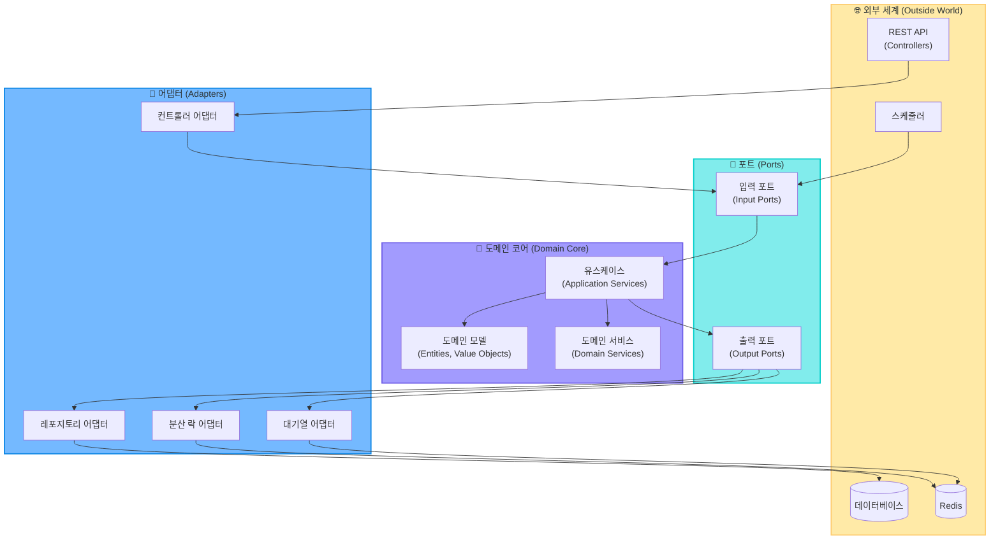

# 8. 아키텍처

## 1. 헥사고날 아키텍처 + DDD

콘서트 예약 서비스는 **헥사고날 아키텍처(Hexagonal Architecture)**를 기본으로 하고 **도메인 주도 설계(DDD)** 개념을 적용하여 구현합니다.



## 2. 아키텍처 레이어 설명

### 2.1. 도메인 레이어 (Domain Layer)

도메인 레이어는 비즈니스 핵심 개념과 규칙을 포함하며, 외부 기술에 독립적입니다.

| 컴포넌트 | 설명 | 예시 |
|---------|------|------|
| **엔티티(Entity)** | 고유 식별자를 가진 도메인 객체 | `User`, `Seat`, `Reservation` |
| **값 객체(Value Object)** | 속성으로만 식별되는 불변 객체 | `Money`, `SeatStatus`, `ReservationStatus` |
| **애그리게이트(Aggregate)** | 일관성을 유지해야 하는 엔티티와 값 객체의 집합 | `Reservation` 애그리게이트 루트와 관련 값 객체 |
| **도메인 서비스(Domain Service)** | 여러 엔티티에 걸친 비즈니스 로직 | `SeatAllocationService`, `PaymentProcessService` |

### 2.2. 애플리케이션 레이어 (Application Layer)

애플리케이션 레이어는 유스케이스를 구현하고 도메인 레이어를 조정하는 역할을 합니다.

| 컴포넌트 | 설명 | 예시 |
|---------|------|------|
| **유스케이스(Use Case)** | 애플리케이션의 핵심 기능을 구현 | `CreateReservationUseCase`, `ProcessPaymentUseCase` |
| **입력 포트(Input Port)** | 외부에서 시스템으로 들어오는 인터페이스 | `ReservationUseCase`, `PaymentUseCase` |
| **출력 포트(Output Port)** | 시스템에서 외부로 나가는 인터페이스 | `UserRepository`, `LockPort`, `QueuePort` |

### 2.3. 어댑터 레이어 (Adapter Layer)

어댑터 레이어는 애플리케이션 레이어와 외부 세계를 연결합니다.

| 컴포넌트 | 설명 | 예시 |
|---------|------|------|
| **입력 어댑터(Input Adapter)** | 외부 요청을 입력 포트로 변환 | `ReservationController`, `PaymentController` |
| **출력 어댑터(Output Adapter)** | 출력 포트를 실제 구현으로 변환 | `JpaReservationRepository`, `RedisLockAdapter` |

## 3. 프로젝트 구조

```
src/
  main/
    kotlin/
      com/example/tdd/
        # 도메인 레이어 (핵심 비즈니스 로직)
        domain/
          model/              # 엔티티, 값 객체
            User.kt
            Reservation.kt
            Seat.kt
            Payment.kt
          repository/         # 리포지토리 인터페이스
            UserRepository.kt
            ReservationRepository.kt
          service/            # 도메인 서비스
            ReservationService.kt
            PaymentService.kt
          
        # 애플리케이션 레이어 (유스케이스)
        application/
          port/
            in/               # 입력 포트(인터페이스)
              ReservationUseCase.kt
              PaymentUseCase.kt
            out/              # 출력 포트(인터페이스)
              LockPort.kt
              QueuePort.kt
          service/            # 유스케이스 구현
            ReservationService.kt
            PaymentService.kt
          
        # 어댑터 레이어
        adapter/
          in/                 # 입력 어댑터
            web/              # API 컨트롤러
              ReservationController.kt
              PaymentController.kt
          out/                # 출력 어댑터
            persistence/      # DB 관련 어댑터
              JpaUserRepository.kt
              JpaReservationRepository.kt
            redis/            # Redis 관련 어댑터
              RedisLockAdapter.kt
              RedisQueueAdapter.kt
        
        # 설정
        config/
          SecurityConfig.kt
          RedisConfig.kt
```

## 4. 주요 구현 원칙

### 4.1. 의존성 규칙

1. **내부로 향하는 의존성**: 외부 레이어는 내부 레이어에 의존할 수 있지만, 내부 레이어는 외부 레이어에 의존할 수 없습니다.
2. **포트와 어댑터 분리**: 모든 외부 시스템과의 상호작용은 포트(인터페이스)를 통해 이루어집니다.
3. **도메인 모델 순수성**: 도메인 모델은 외부 프레임워크나 라이브러리에 의존하지 않아야 합니다.

### 4.2. 동시성 제어 패턴

1. **분산 락 활용**: Redis 기반 분산 락을 통해 좌석 예약의 동시성 문제를 해결합니다.
   ```kotlin
   // 출력 포트 정의
   interface LockPort {
       fun acquireLock(resourceId: String, ownerId: String, ttlMillis: Long): Boolean
       fun releaseLock(resourceId: String, ownerId: String): Boolean
   }
   
   // 유스케이스에서 활용
   @Transactional
   fun reserveSeat(userId: String, seatId: String): ReservationResult {
       val lockAcquired = lockPort.acquireLock("seat:$seatId", userId, 3000)
       if (!lockAcquired) {
           return ReservationResult.SEAT_ALREADY_LOCKED
       }
       
       try {
           // 비즈니스 로직 수행
           // ...
       } finally {
           lockPort.releaseLock("seat:$seatId", userId)
       }
   }
   ```

2. **트랜잭션 관리**: 데이터베이스 트랜잭션을 활용하여 상태 변경의 원자성을 보장합니다.

### 4.3. 대기열 시스템 패턴

1. **토큰 기반 인증**: 대기열 토큰을 통해 사용자의 접근을 제어합니다.
   ```kotlin
   // 출력 포트 정의
   interface QueuePort {
       fun addToQueue(userId: String): Long  // 대기열 위치 반환
       fun getActiveUsers(limit: Int): List<String>  // 활성 사용자 목록
       fun isUserActive(userId: String): Boolean  // 사용자 활성 상태 확인
   }
   
   // 유스케이스에서 활용
   fun processRequest(userId: String, request: Any): Result {
       if (!queuePort.isUserActive(userId)) {
           return Result.NOT_AUTHORIZED
       }
       
       // 요청 처리 로직
       // ...
   }
   ```

2. **주기적 활성화**: 스케줄러를 통해 주기적으로 대기열에서 일정 수의 사용자를 활성 상태로 전환합니다.

## 5. 헥사고날 아키텍처의 장점

1. **핵심 비즈니스 로직 보호**: 도메인 모델과 비즈니스 규칙이 외부 의존성으로부터 격리됩니다.

2. **유연한 인프라 교체**: Redis 대신 다른 솔루션으로 변경하더라도 핵심 로직은 변경할 필요가 없습니다.

3. **테스트 용이성**: 도메인 로직과 유스케이스를 외부 의존성 없이 독립적으로 테스트할 수 있습니다.

4. **명확한 경계**: 각 컴포넌트의 책임과 경계가 명확하여 코드 이해와 유지보수가 쉽습니다.

5. **확장성**: 새로운 기능이나 인터페이스 추가가 기존 코드에 영향을 최소화합니다.

## 6. 테스트 전략

헥사고날 아키텍처의 이점을 활용한 계층별 테스트 전략:

| 테스트 유형 | 대상 | 목적 | 모의 대상 |
|------------|-----|------|-----------|
| **단위 테스트** | 도메인 모델, 도메인 서비스 | 비즈니스 규칙 검증 | 없음 |
| **통합 테스트** | 애플리케이션 서비스 | 유스케이스 검증 | 출력 포트 |
| **어댑터 테스트** | 어댑터 | 외부 시스템 연동 검증 | 실제 DB, Redis |
| **E2E 테스트** | 전체 시스템 | 엔드 투 엔드 시나리오 검증 | 없음 |

헥사고날 아키텍처를 통해 콘서트 예약 서비스의 핵심인 동시성 제어와 대기열 관리를 보다 견고하게 구현할 수 있습니다.
