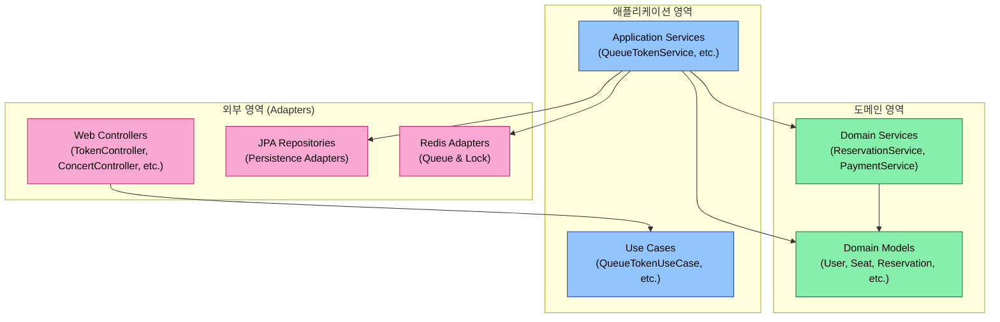

```mermaid
graph TB
    subgraph "외부 영역 (Adapters)"
        WebController["Web Controllers<br>(TokenController, ConcertController, etc.)"]
        JPA["JPA Repositories<br>(Persistence Adapters)"]
        RedisAdapter["Redis Adapters<br>(Queue & Lock)"]
    end

    subgraph "애플리케이션 영역"
        UseCase["Use Cases<br>(QueueTokenUseCase, etc.)"]
        AppService["Application Services<br>(QueueTokenService, etc.)"]
    end

    subgraph "도메인 영역"
        DomainService["Domain Services<br>(ReservationService, PaymentService)"]
        DomainModel["Domain Models<br>(User, Seat, Reservation, etc.)"]
    end

    %% 외부 → 애플리케이션 연결
    WebController --> UseCase
    AppService --> JPA
    AppService --> RedisAdapter

    %% 애플리케이션 → 도메인 연결
    AppService --> DomainService
    AppService --> DomainModel
    DomainService --> DomainModel

    %% 스타일 정의
    classDef adapter fill:#f9a8d4,stroke:#be185d,color:#000000
    classDef application fill:#93c5fd,stroke:#1e40af,color:#000000
    classDef domain fill:#86efac,stroke:#166534,color:#000000

    class WebController,JPA,RedisAdapter adapter
    class UseCase,AppService application
    class DomainService,DomainModel domain
```
